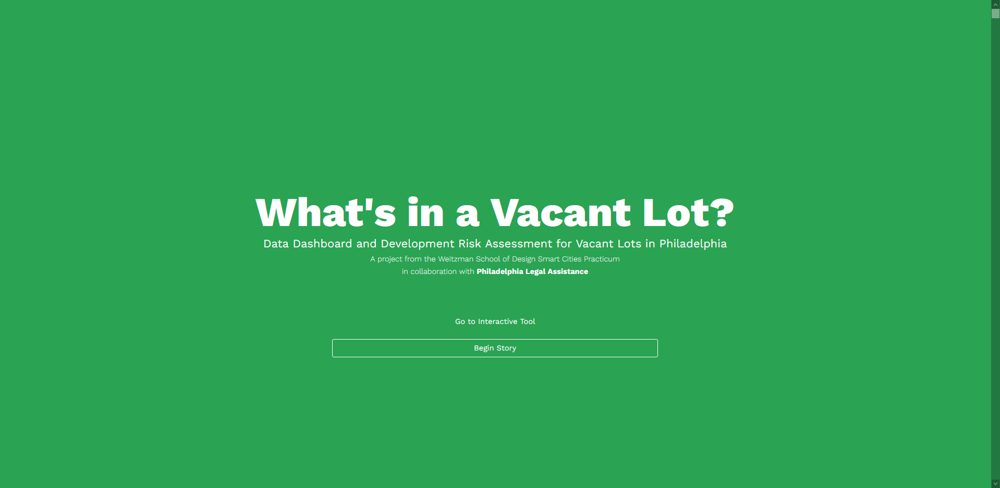
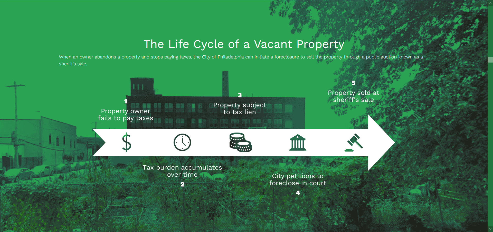
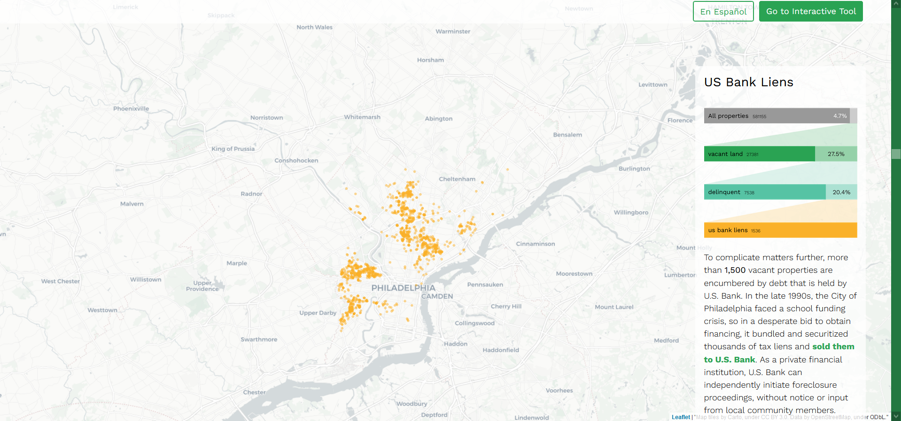
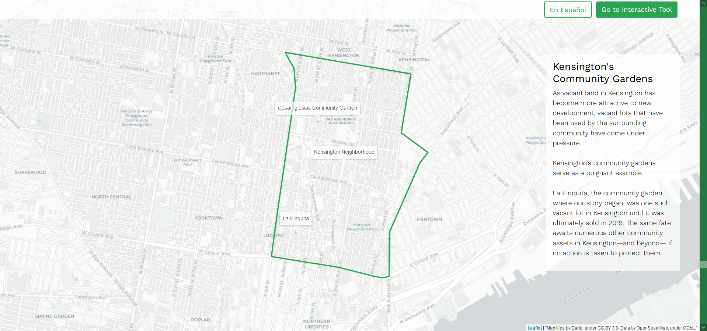
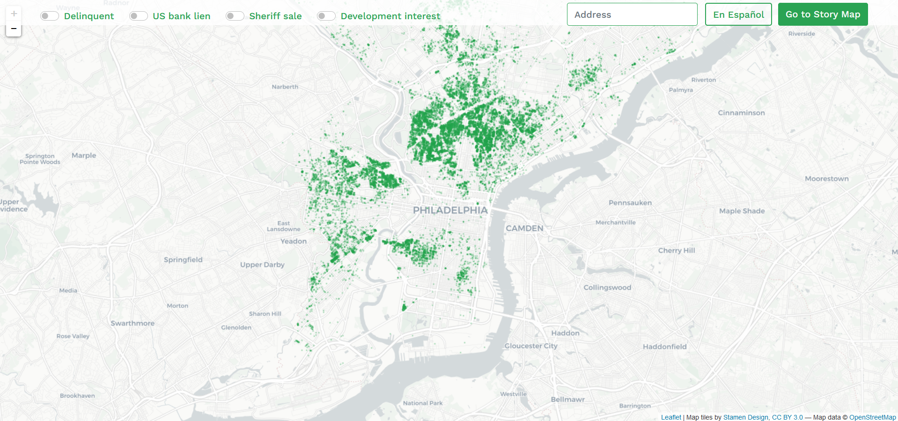
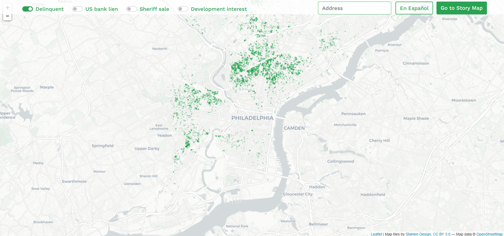
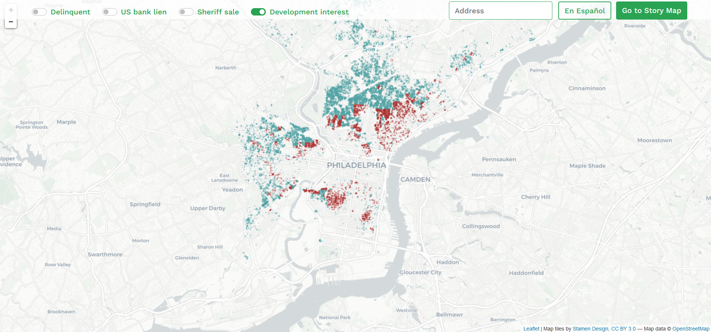
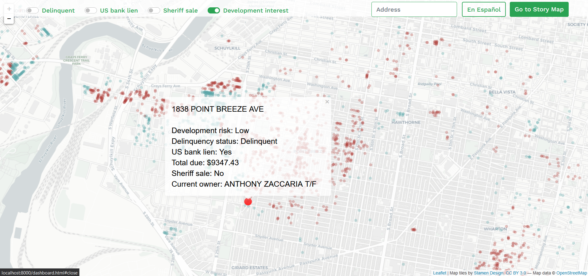
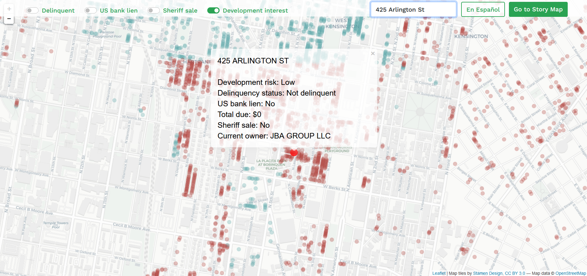

# [What's in a Vacant Lot?](https://golete.github.io/vacant-lots/）
* Data Dashboard and Development Risk Assessment for Vacant Lots in Philadelphia
* A project from the Weitzman School of Design Smart Cities Practicum in collaboration with Philadelphia Legal Assistance

In recent years, the City of Philadelphia has been foreclosing on tax delinquent vacant properties in bulk. Many of these properties represent cherished community assets including public parks, urban gardens, and side yards. Often, neighbors who have tended to these properties for years never find out that they are up for sale until they have already been bought. A variety of grassroots and legal advocacy organizations have taken up the mantle to explore these options, and more, to ensure that vacant lots remain in the care of the neighbors and communities who have invested in them for years. 

In collaboration with Philadelphia Legal Assistance (PLA), we are creating a data dashboard and storymap:
1. to visualize and explore the vacant lots in Philadelphia; 
2. to assist PLA in weighing viable legal and policy interventions;
3. to predict which properties are at greatest risk of disposition and development.

## Scrolling Story Map
The scrolling Story Map help familiarize one with the story of vacant lots and delinquencies in Philadelphia. It is a simple step-by-step walkthrough of the different actors and topics surrounding the complex issue.

For example, it explains the life cycle of a vacant property.

It also covers the statistics of properties with US bank liens out of all properties, vacant properties, and delinquent properties.

After unfolding the story on a city-wide scale, our Story Map ends up where it began - in the Kensington neighborhood. Even though La Finquita is closed, we highlight the at-risk Cesar Iglesias Community Garden, further north in the neighborhood, and we highlight actions that our client is taking to protect these assets.

## Data Dashboard
The data dashboard allows one to explore vacant lots in Philadelphia.

With four buttons, one can filter for vacant lots and their statuses including delinquency state, association with US bank lien, history of sheriff sale, and predicted development interest, by turning the buttons on or off. The screenshot shows all vacant lots that are tax delinquent as of now (2022).

As we have developed an algorithm that predicts which properties are at greatest risk of disposition and development, one can click on the development interest button to see the location of these properties. While all points shown here are predicted to be of development interest, the points in red are predicted to be of high interest for this year (2022) if we were back in 2019 and only have information such as change of median income or nearby crime count then.

One can also click on any point to see their information aggregated from public records. These include their address information, predicted development risk, delinquency status, whether it was sold as a US bank lien, total amount due, whether it was scheduled for sheriff sales, and the current owner. After a property is being clicked on, it will change its color to maroon to highlight its location. The color can be reset simply by unclicking the point.
 

In addition, one can search for specific properties by entering their addresses into the search box on the top right of the screen. After pressing enter, the dashboard will zoom in on the property and show its information. As an example, if people are curious about the Iglesias Garden, they could insert its address "425 Arlington St" into the search box. This will take them to its location on the map and tell them that its risk of development is low for the year 2022.

## Data
Our project used data from Open Data Philly, including properties, vacant lots, real estate delinquencies, real estate transfers, L&I Zoning Permits. It also implements data from the 2019 American Community Survey to determine the divide between majority-white and majority-minority neighborhoods, as well as the divide in above and below median income households. This data was preprocessed and condensed for the purposes of the Smart Cities Practicum project and exported into several files to be read by this application.
